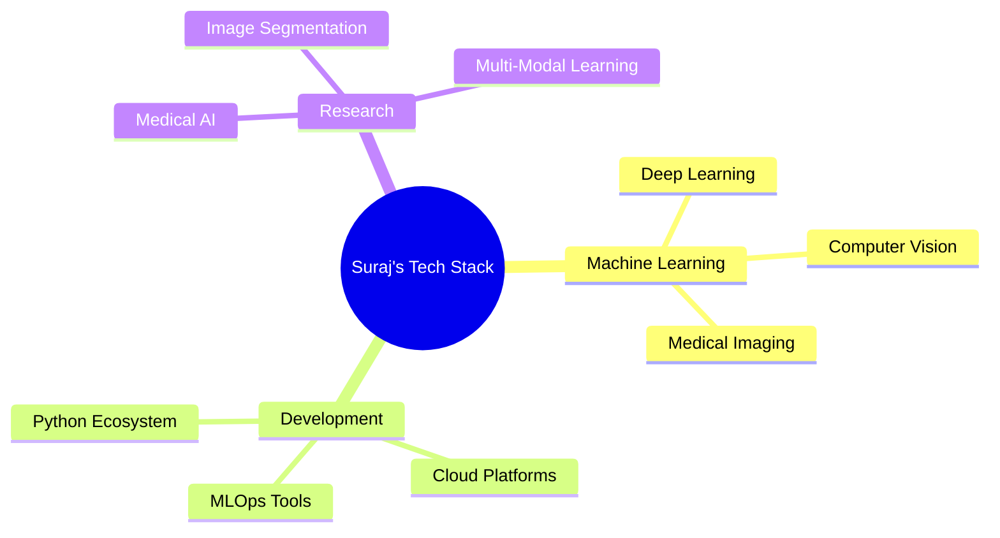

<!--Header Animation-->
<p align="center">
  
</p>

<!--Animated Typing Effect-->
<p align="left">
  
</p>


<!-- Night Owl Image with Enhanced Styling
<div align="right">
  
</div> -->

<!--Profile Views & Social Proof-->
<p align="left">
  
  
  
</p>

<br>

<!--About Me Section with Enhanced Design-->
##  About Me

```yaml
name: Suraj Sah Kanu
role: ML Engineer & Medical Imaging Researcher
location: Kathmandu, Nepal
workplace: NAAMII (Nepal Applied Mathematics and Informatics Institute)
education: Computer Science Student
passion: "Building AI solutions that make healthcare accessible and effective"
current_mission: "Advancing medical diagnostics through deep learning"
```


<!--What I Do Section-->
##   The Tech That Fuels Me

<table>
<tr>
<td width="50%">

### 🔬 Medical Imaging Research
Building deep learning models for:
- Medical image segmentation
- Disease detection & diagnosis
- Multi-modal imaging analysis
- Healthcare AI applications

</td>
<td width="50%">

### 🧠 Computer Vision
Creating intelligent systems for:
- Visual data understanding
- Object detection & tracking
- Image processing pipelines
- Real-time video analytics

</td>
</tr>
<tr>
<td width="50%">

### 📊 Data Analytics
Specializing in:
- Complex dataset analysis
- Statistical modeling
- Predictive analytics
- Data visualization

</td>
<td width="50%">

### 🤖 Deep Learning
Architecting networks for:
- CNN & Transformer models
- Transfer learning
- Model optimization
- Production deployment

</td>
</tr>
</table>


<!--Current Focus with Icons-->
## 🎯 Current Focus & Goals

<div align="center">

| 🎓 Learning | 🔬 Research | 💻 Building | 🌟 Contributing |
|-------------|-------------|-------------|-----------------|
| Advanced ML/AI | Medical Imaging @ NAAMII | [Portfolio Projects](https://surajsahkanu.vercel.app/) | Open Source & Papers |
| Computer Vision | Deep Learning for Healthcare | AI-Powered Solutions | Community Support |
| Cloud & DevOps | Multi-Modal Analysis | Production ML Systems | Knowledge Sharing |

</div>


<!--Technical Skills Section-->
## 🛠️ Technical Arsenal

<details open>
<summary><b>🎯 Core Specializations</b></summary>
<br>



</details>

<details open>
<summary><b>💻 Languages & Frameworks</b></summary>
<br>
<div align="center">

### Core Languages


### ML/AI Frameworks


### Web & APIs


### DevOps & Cloud


### Development Tools


### Databases


</div>
</details>

<details>
<summary><b>📚 Research Interests</b></summary>
<br>

- 🏥 **Medical Image Segmentation** - Precise anatomical structure delineation
- 🔍 **Multi-Modal Imaging** - Fusion of different imaging modalities
- 🧬 **Deep Learning for Healthcare** - AI-powered diagnostic systems
- 📊 **Explainable AI** - Interpretable models for medical applications
- 🎯 **Transfer Learning** - Adapting models for medical domains

</details>


<!--GitHub Stats Section-->
## 📊 GitHub Analytics

<div align="center">
  

  
</div>

<!--Profile Summary-->
<div align="center">
  
</div>

<!--Contribution Graph-->
<div align="center">
  
</div>

<!--GitHub Trophies-->
<div align="center">
  
</div>


<!--Featured Projects-->
## 🚀 Featured Projects

<div align="center">

[](https://github.com/sahkanu34/Neuro_Scan_AI)

</div>

<p align="center">
  <a href="https://github.com/sahkanu34?tab=repositories" target="_blank">
    
  </a>
</p>


<!--Connect Section-->
## 🤝 Let's Connect & Collaborate

<div align="center">

I'm always excited to collaborate on innovative ML projects, discuss research ideas, or contribute to open-source initiatives!

<br><br>

<a href="https://surajsahkanu.vercel.app/" target="_blank">
  
</a>
<a href="https://www.linkedin.com/in/sahkanu34" target="_blank">
  
</a>
<a href="https://github.com/sahkanu34" target="_blank">
  
</a>
<a href="mailto:surajsah132@gmail.com" target="_blank">
  
</a>
<a href="https://www.instagram.com/suraj_sah_kanu" target="_blank">
  
</a>

<br><br>

### 📧 Open For

```python
opportunities = {
    "collaborations": ["Research Projects", "Open Source", "ML Initiatives"],
    "discussions": ["AI/ML", "Medical Imaging", "Computer Vision"],
    "consulting": ["Healthcare AI", "Deep Learning", "MLOps"],
    "mentoring": ["Students", "Junior Developers", "AI Enthusiasts"]
}

print("Feel free to reach out! Let's build something amazing together 🚀")
```

</div>


<!--Snake Animation-->
<div align="center">
  
</div>

<!--Quote-->
<div align="center">
  
</div>

<!--Footer-->
<p align="center">
  
</p>

<div align="center">
  
### Show some ❤️ by starring some repositories!


</div>
